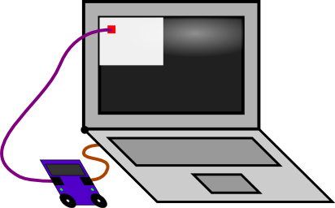

# StimSync API

The StimSync is a simple open source device for recording events (button presses, vocal sounds) and controlling events (switching on electrical devices, triggering brain stimulation) for neuroscience experiments. The device emulates a standard USB keyboard, offering plug-and-play convenience for most experiments. Most users will find the main StimSync web page sufficient for describing usage, and the [oscilloscope page](https://github.com/neurolabusc/oscilloscope) sufficient for describing how to record analog signals. The purpose of this web page is to describe the 'Application Programming Interface' for developers.

The StimSync simultaneously simulates a USB human interface device (HID) keyboard as well as a traditional serial device communicating over the USB cable (here after referred to as the serial port). The serial port can also be emulated via a paired Bluetooth connection. The HID connection is only used to send keyboard signals, the serial port is used to write to the digital outputs, change the device settings, stream raw data from the analog to digital converters.

For exposition, this page provides Python code (2.6 or later, including the [controversial version 3](https://jakevdp.github.io/blog/2013/01/03/will-scientists-ever-move-to-python-3/) ) for communicating with this device (and requires the [pySerial](https://pypi.org/project/pyserial/) library). However, you can use any computer language that allows you to connect with the serial port. For example, the oscilloscope project provides code for communicating with the StimSync in the Matlab, Xcode, Freepascal/Lazarus and Processing languages. Further the sample experiments included with the main page also show how to communicate using EPrime and Psychtoolbox.

## Connecting to the HID Device

Simply plug the StimSync into the USB port and the host computer will see the device as a USB HID keyboard. The 8 digital buttons and two analog inputs will be mapped to the keyboard keys. To change the key mapping you can use the graphical key mapper software, or if you wish you can change the mapping by sending signals over the serial port.

## Connecting to the Serial Port

When you plug the StimSync into the USB port (or pair with its Bluetooth module) your computer will detect a new serial port. You will want to know the port used by the StimSync, on Windows you can check your device manager to find the port (e.g. "COM4"), on Unix computers you can type "ls /dev/tty.\*", with the StimSync typically having a name that starts with "us", for example "/dev/tty.usbmodem7071". The StimSync firmware download includes examples in Matlab, XCode, FreePascal/Lazarus, Processing and Python that show how to autodetect this port. For brevity, most of sample code on this web page assumes the device is named "/dev/tty.usbmodem7071″. The minimal connection would be as follows:

``` {.Python}
import serial
ser = serial.Serial('/dev/tty.usbmodem7071', 115200, timeout=1)
#...do something profound
ser.close()
```

A more advanced connection would check the active serial ports and then test that a StimSync is available. One way to see if a StimSync is attached is to 'set' the device mode (e.g. put the StimSync into keyboard mode) and then 'get' the device mode (e.g. query what mode the device is in). The following Python script encapsulates this into a single function -- just remember to 'close' the port after you open it with this command:

``` {.Python}
import os, serial
from serial.tools import list_ports
def open_arduino_port():
available = []
if os.name == 'nt': # Windows
for i in range(256):
try:
s = serial.Serial(i)
available.append('COM'+str(i + 1))
s.close()
except serial.SerialException:
pass
if len(available) < 1:
print ('Error: unable to find Arduino: no COM ports detected. Check drivers.')
return []
print ('Possible list of available serial ports:')
print (available)
else: # Mac / Linux
available = [port[0] for port in list_ports.comports()]
print ('Possible list of available serial ports:')
print ( available )
available = [s for s in available if ".us" in s]
if len(available) < 1:
print ('Error: unable to find Arduino port named ".us": check drivers')
print ('assuming Arduino attached to port %s' %(available[0]))
serPort = serial.Serial(available[0], 115200, timeout=1)
serPort.write(bytearray( (177,163,169,169) )) #set to keyboard mode 177,163,169,169
serPort.flushInput()
serPort.write(bytearray( (169,163,169,169) )) #get current mode 169,163,169,169 we expect the reply 169,163,169,169
serPort.flush() #send command
obs = bytearray(serPort.read(4)) #get reply
if obs != bytearray( (169,163,169,169) ) :
print ('Warning: the selected port does not have a StimSync attached')
return serPort ser = open_arduino_port()
#…do something profound
ser.close()
```

The StimSync has 7 independent digital outputs. These provide up to 20mA at 5v for AVR devices (Leonardo, Teensy 2) and 9.4mA at 3.3v for ARM devices (Due, Teensy 3). You can use these to switch on an off digital devices like light emitting diodes, trigger brain stimulation, etc. For devices that require more current you can use the output drive a relay (e.g. the solid state AQZ207). To turn on or off devices one sends a single byte with the value 0..127 to the StimSync (it is important not to send values larger than 127, as these are used for commands to reconfigure the StimSync). The digital outputs 1,2,3,4,5,6,7 are represented by the binary values 1,2,4,8,16,32,64 -- so you send the sum of the inputs you want on. In other words, 0 means all off, 127 means all on and 11 means outputs 1,2,4 are on and the others are off. When using this feature, you should see if your programming language has a command that sends the data immediately, otherwise the computer may delay a while to see if it can send a larger packet of bytes. This example code shows how to control the 7 digital outputs. It works just like the example for PsychoPy.

``` {.Python}
import serial
ser = serial.Serial('/dev/tty.usbmodem7071', 115200, timeout=1)
ser.write(bytearray([ 11 ] ) )
ser.flush() #send data immediately
ser.close()
```

## StimSync Commands

The previous section notes that digital outputs are set by sending a single byte with a value 0..127 to explicitly set the state of each output pin. In contrast, configuring the keyboard or using the StimSync in microsecond/oscilloscope modes is done by sending 4-byte long commands where the first byte is either SET (177) or GET (169). Practical examples for these commands are described in subsequent sections, while this section provides an exhaustive list of the supported commands.

SET commands (where the first byte is 177) change Arduino settings. SET commands will typically be forgotten when the ARDUINO restarts. However, the SET:EEPROMSAVE command will have the ARDUINO remember keyboard settings (keyup, keydown, keytrigger and debounce values).

**List of Set commands:**

-   

    SET:MODE: 163 -change whether Arduino acts as a USB Keyboard, Microsecond Timer or Oscilloscope

    :   -   SET:MODE:KEYBOARD 169,169 -- digital inputs mimic a USB
            keyboard \[177,163,169,169\]
        -   SET:MODE:USEC 181,181 -- used for precise timing and to
            change keyboard mapping \[177,163,181,181\]
        -   SET:MODE:OSC 162,162- used to plot analog inputs
            \[177,163,162,162\]
        -   Example: \[177,163,181,181\] switches the Arduino to uSec
            mode
        -   Tip: From Arduino SerialMonitor sending '±£©©' sets
            keyboard, '±£µµ' sets uSec, '±£¢¢' sets oscilloscope

-   

    SET:KEYDOWNPRESS:\[LINE\]:\[MAPPING\] 129 -- change USB key stroke sent when key depressed

    :   -   Example \[177,129,2,72\] pressing 2nd button will elicit 'H'
            (ASCII=32)
        -   Special: MAPPING 0 means no response is generated
        -   Example \[177,129,3,0\] pressing 3rd button will not create
            a response
        -   Special: LINE 0 changes debounce time
        -   Example \[177,129,0,44\] sets debounce time to 44ms

-   

    SET:KEYUPPRESS:\[LINE\]:\[MAPPING\] 130 -- change USB key stroke sent when key released

    :   -   Example \[177,130,2,72\] releasing 2nd button will elicit
            'H' (ASCII=32)
        -   Special: MAPPING 0 means no response is generated
        -   Example \[177,130,3,0\] releasing 3rd button will not create
            a response

-SET:KEYTRIGGER:\[LINE\]:\[MAPPING\] 131 -- bing digital out to digital input

:   -   Example \[177,131,2,3\] down/up of second button determines
        on/off of 3rd output line
    -   Special: MAPPING 0 removes binding
    -   Example \[177,131,3,0\] status of 3rd button does not influence
        any outputs

\- SET:OSCHZ:\[HZhi\]:\[HZlo\] 132 -- set sample rate of Oscilloscope (Hz)

:   -   Example \[177,132,1,244\] sets 500Hz sampling rate
    -   Example \[177,132,0,125\] sets 125Hz sampling rate

\- SET:OSCCHANNELS:\[CHANNELShi\]:\[CHANNELSlo\] 133 -- set number of analog inputs reported by Oscilloscope

:   -   Example \[177,133,0,6\] sets recording to 6 inputs

\- SET:EEPROMSAVE:EEPROMSAVE:EEPROMSAVE 134 -- save current settings to EEPROM so it will be recalled

:   -   Example \[177,134,134,134\] stores current settings in
        persistent memory

\- SET:NUMANALOGKEYS:\[NUMhi\]:\[NUMlo\] 135 -- bind digital out to digital input

:   -   Example \[177,135,0,1\] enable 1 analog key (currently 0,1,2)

\- SET:SUPERSAMPLE:\[NUMhi\]:\[NUMlo\] 136 -- average 2\^VALUE subsamples per reported sample \[DEFAULT = 0\]

:   -   Example \[177,136,0,3\] average 2\^3=8 subsamples, so a reported
        100 Hz data set is based on 800 Hz recording
    -   Example \[177,136,0,0\] average 2\^0=1 subsamples, so a reported
        100 Hz data set is based on 100 Hz recording

GET commands (where the first byte is 163) request the Arduino to report
its current settings. This allows you to check that a StimSync is
attached and query its current settings. GET commands are identical to
SET commands, but have Arduino Report Settings rather than change
settings

-   Example: \[169,163,0,0\] requests mode, if Arduino is in uSec mode
    it will respond \[169,163,181,181\]
-   Example: \[169,129,5,0\] requests down-press mapping for fifth key,
    if this is 'i' (ASCII=105) the Arduino responds \[169,129,5,105\]

## Setting Key Mappings

You can program each button to generate a desired keyboard character both when the key is pressed and when the key is released. The optional EEPROM command will save these changes are stored persistently in the Arduino memory, so the key mapping is remembered even when the Arduino is unplugged and plugged into a different keyboard. There is one exception to this rule: the Arduino Due does not have EEPROM (unlike the Leonardo or Teensy devices), so for this device key mappings are not saved when the device is unplugged. Send the [ASCII](https://arduino.cc/en/Reference/ASCIIchart) code to specify the desired key, use null (0) if you desire no action. For example it is typical to specify keys for down-presses but no action for key releases. You can also specify a de-bounce time (in milliseconds) by setting a key-press action for the (non-existent) 0th key, as shown in the sample below. Note your software can read key mappings using the \"get\" command in place of the set command.

``` {.Python}
import serial
ser = serial.Serial('/dev/tty.usbmodem7071', 115200, timeout=1)
ser.write(bytearray( (177,129,1,ord('A')) )) #set key-press 1st button to 'A' (177,129,1,'A')
ser.write(bytearray( (177,129,2,ord('b')) )) #set key-press 2nd button to 'b' 177,129,2,'b'
ser.write(bytearray( (177,130,1,ord('1')) )) #set key-release 1st button ='1' 177,130,1,'1'
ser.write(bytearray( (177,129,0,123) )) #set de-bounce time to 123ms 177,129,0,123
ser.write(bytearray( (177,134,134,134) )) #set EEPROM to store mapping 177,134,134,134
ser.close()
```

## Setting 'Microsecond' Input Mode

In the default 'Keyboard' mode the StimSync emulates a standard HID USB keyboard. The device requires the best-possible 1ms polling rate, so hopefully you will get accurate timing with this mode. As [Ulrich and Giray (1989)](https://onlinelibrary.wiley.com/doi/10.1111/j.2044-8317.1989.tb01111.x/abstract) have noted, USB devices typically provide more than sufficient accuracy for behavioral studies. However, it is sometimes desirable to achieve higher resolution sampling, for example if you want to see if an experiment is always generating a Transcranial Magnetic Stimulation (TMS) pulse precisely 50ms after an image is displayed on a screen. The StimSync microsecond timing mode uses the serial port to send a time-stamped packet every time a button press is detected. While we refer to this as 'microsecond timing', it should be noted that the sequential sampling of each input and other tasks such as serial port communications means this mode may not provide microsecond precision, even though it provides microsecond resolution. In any case, this provides more accuracy than is possible with USB keyboard timing, though you need to run specialized code to record these files. The StimSync `Keyboard Mapper Tool <my_stimsync>`{.interpreted-text role="ref"} logs these time stamps, so is a simple interface for most users to record microsecond timing.

In order to engage the microsecond mode, one sends the SET:MODE:USEC (177,163,181,181) command. The microsecond mode will generate a packet with each input change until the mode is changed. Each packet includes a 32-bit unsigned integer reporting the time since the device was switched on -- note this value overflows (goes back to zero) approximately every 70 minutes, so you may want your software to account for this. Typically one should return the device to the (default) keyboard mode when the microsecond recording is completed. For every change in inputs (StimSync key press or key release) the device sends 8 bytes (0..7):

 -   0: kuSecSignature (254)
 -   1: HIGH(1) byte keybits
 -   2: LOW(0) byte of keybits
 -   3: HIGH(3) byte of uSec
 -   4: 2 byte of uSec
 -   5: 1 byte of uSec
 -   6: 0 byte of uSec
 -   7: Checksum -- sum of all previous bytes folded to fit in 0..255

Here is a sample script that will report the microseconds of a response that occurs within 10 seconds of running the script:

``` {.Python}
import serial
ser = serial.Serial('/dev/tty.usbmodem7071', 115200, timeout=10)
ser.flushInput()
ser.write( bytearray((177,163,181,181)) ) #set usec mode 177,163,181,181
ser.flush()
obsBin = bytearray(ser.read(8)) #get reply
if len(obsBin) != 8:
print('Error: no buttons presses detected')usec = (obsBin[3] << 24)+ (obsBin[4] << 16)+ (obsBin[5] << 8)+obsBin[6]
keys = (obsBin[1] << 8)+obsBin[2]
print('detected keysBits %d at %d usec' % (keys, usec) )
ser.write( bytearray((177,163,169,169)) ) #turn off oscilloscope: set keyboard mode 177,163,169,169
ser.close()
```

## Setting Oscilloscope Streaming

The StimSync always starts up in keyboard mode. If you set the device to oscilloscope mode it will begin streaming data that describes the signal measured by the analog to digital (ADC) converters. The `StimSync firmware <my_oscilloscope>`{.interpreted-text role="ref"} provides example plotting programs in the XCode, Matlab, Freepascal/Lazarus and Processing languages that use this mode, and a good description is provided on the `oscilloscope <my_oscilloscope>`{.interpreted-text role="ref"} page. We suggest using one of these sample programs to understand this mode.

In brief, it is typically a good idea to set the desired sample rate and number of channels while the device is in keyboard mode, and then switch on the oscilloscope mode. AVR-based devices (Leonardo, Teensy 2) will typically sample from the range 0..5v using the 10-bit resolution of 0..1023, the ARM-based devices sample from 0..3.3v using 12-bit (Due, 0..4095) or 16-bit (Teensy 3, 0..65535) resolution. Note that Arduino ADCs are very noisy, and the precision is typically far worse than the resolution (e.g. the least significant bits will vary between successive samples of a constant signal). To deal with this, the StimSync will attempt to use hardware averaging (for example, each Teensy 3 sample is actually the average of 64 samples). In addition, the StimSync API allows you to supersample the data in software, for example a 100 Hz sampling rate with x4 supersampling will mean the ADC is actually sampled at 1600 Hz (100\*2\^4), with the average of every 16 evenly spaced samples reported 100 times per second. Be aware that in this example the average sampling time is almost 5ms before the reported sampling time (e.g. it is averaging with prior data samples).

When the Arduino is in Oscilloscope mode, it will send the computer a packet of data each sample. The length of the packet is 4+2\*OSCCHANNELS bytes, where OSCCHANNELS is the number of channels reported. Consider a system reporting two channels. Each sample transmits 8 bytes (0..7):

 -   0: SIGNATURE BYTE -- bits as specified
 -   7 (MSB): ALWAYS 0 (so packet can not be confused with a COMMAND)
 -   4-6: SAMPLE NUMBER: allows software to detect dropped samples and
     decode timing. Increments 0,1,2..7,0,1,2..7,0....
 -   3-0 (LSB): Timing in milliseconds. This nybble encodes time in
     milliseconds at Sample 0. Time is acquired at SAMPLE NUMBER is 0,
     with 32-bit value transmitted in 4 bit chunks.For sample 0, the
     nybble is bit-shifted 28 bits, sample 1 is shifted 24 bits, etc.
 -   1: DIGITAL INPUT HIGH BYTE echoes status of 7 digital outputs
 -   2: DIGITAL INPTUT LOW BYTE status of 8 digital inputs
 -   3: ANALOG INPUT HIGH byte for Channel 1
 -   4: ANALOG INPUT LOW byte for Channel 1
 -   5: ANALOG INPUT HIGH byte for Channel 2
 -   6: ANALOG INPUT LOW byte for Channel 2
 -   7: CHECKSUM -- sum of all previous bytes folded to fit in 0..255

Here is an example python script for recording from 2 channels:

``` {.Python}
import serial
ser = serial.Serial('/dev/tty.usbmodem7071', 115200, timeout=1)
ser.write(bytearray(( 177,163,169,169))) #set keyboard mode 177,163,169,169
ser.write( bytearray((177,132,0,125)) ) #set oscilloscope for 125Hz sampling rate 177,132,0,125
ser.write( bytearray((177,133,0,2)) ) #set oscilloscope for 2 channels 177,133,0,2
serPort.flushInput()
ser.write( bytearray((177,163,162,162)) ) #set oscilloscope mode 177,163,162,162
ser.flush()
obsBin = bytearray(ser.read(8)) #get reply
if len(obsBin) != 8:
print('Error: did not receive data')dig = (obsBin[1] << 8)+obsBin[2] #holds values for digital inputs (buttons) and outputs
ch1 = (obsBin[3] << 8)+obsBin[4]
ch2 = (obsBin[5] << 8)+obsBin[6]
print('Channel 1: %d Channel 2: %d digitalIO %d' % (ch1, ch2, dig))
ser.write(bytearray(( 177,163,169,169))) #turn off oscilloscope: set keyboard mode 177,163,169,169
ser.close()
```

## PsychoPy Example

Here is a complete example of a simple experiment in PsychoPy. In this example all the digital outputs will pulse on 5 times, along with the screen. To test this you can plug a light emitting diode (with suitable resistor, e.g. 220 Ohm) to one of the digital outputs. This script shows how to write to the StimSync at any arbitrary time, while the timing scripts described in other sections show how to use PsychoPy's callOnFlip function to time-lock the digital outputs with a screen event. You can paste the script into PsychoPy's coder view and run.

``` {.Python}
import os, serial
from serial.tools import list_ports
def open_arduino_port():
available = []
if os.name == 'nt': # Windows
for i in range(256):
try:
s = serial.Serial(i)
available.append('COM'+str(i + 1))
s.close()
except serial.SerialException:
pass
if len(available) < 1:
print ('Error: unable to find Arduino: no COM ports detected. Check drivers.')
return []
print ('Possible list of available serial ports:')
print (available)
else: # Mac / Linux
available = [port[0] for port in list_ports.comports()]
print ('Possible list of available serial ports:')
print ( available )
available = [s for s in available if ".us" in s]
if len(available) < 1:
print ('Error: unable to find Arduino port named ".us": check drivers')
print ('assuming Arduino attached to port %s' %(available[0]))
serPort = serial.Serial(available[0], 115200, timeout=1)
serPort.write(bytearray( (177,163,169,169) )) #set to keyboard mode 177,163,169,169
serPort.flushInput()
serPort.write(bytearray( (169,163,169,169) )) #get current mode 169,163,169,169 we expect the reply 169,163,169,169
serPort.flush() #send command
obs = bytearray(serPort.read(4)) #get reply
if obs != bytearray( (169,163,169,169) ) :
print ('Warning: the selected port does not have a StimSync attached')
return serPortfrom psychopy import visual, core #import some libraries from PsychoPy
ser = open_arduino_port() #open the StimSync
#stimuli
mywin = visual.Window([800,600],fullscr=False,monitor="testMonitor", units="deg")
mywin.setMouseVisible(False)
#create some stimuli
dark = visual.PatchStim(win=mywin, size=1, pos=[0,0], sf=0, color=-1)
bright = visual.PatchStim(win=mywin, size=1, pos=[0,0], sf=0, color=1)
#show the trials
for x in range(0, 5):
bright.draw()
mywin.flip()
ser.write(bytearray( [127] ) ) #turn on all outputs
ser.flush()
dark.draw()
mywin.flip()
ser.write( bytearray( [0] ) ) #turn off outputs
core.wait(1.0) 
```

## Testing Timing



Here is a PsychoPy script for measuring input latency for the StimSync acting as a USB keyboard. The setup is shown on the right: the plug StimSync into the computer's USB port (brown cable) and connect a [light sensor](https://www.sparkfun.com/products/8688) (red) to the computer monitor and one of the StimSync analog inputs (purple cable). For CRT cables, you will want to attach the sensor near the top of the screen (since the screen drawing begins from the top). Adjust the StimSync thumbwheel so a white screen triggers a key press. Next, run the following PsychoPy script (after you get this working you probably want to make 'nreps' a larger number so you can average over a larger number of trials). In general the latency of the timing is not a huge concern -- if it is constant across all conditions it will have no influence on the subsequent statistics (though it may be useful to know for iEEG/ERP studies). On the other hand, relatively low variability is desirable.

``` {.Python}
from psychopy import visual, core, event, data
#import some libraries from PsychoPystimList = [{'cond': 1}]
nReps = 10 #number of repititions per condition
trials = data.TrialHandler(stimList,nReps,dataTypes='RT')
mywin = visual.Window([800,600],allowGUI=False,fullscr=False, units="norm", color=-1)
mywin.setMouseVisible(False)
#create some stimuli
dark = visual.PatchStim(win=mywin, size=0.1, pos=[0,0], sf=0, color=0, colorSpace='rgb')
bright = visual.PatchStim(win=mywin, size=1, pos=[-0.5,0.5], sf=0, color=1, colorSpace='rgb')
#draw the stimuli and update the window
event.clearEvents()
startTime = core.Clock() # make a clock for capturing RT (reaction time)
for thisTrial in trials: #handler can act like a for loop
bright.draw()
mywin.callOnFlip(startTime.reset) # reaction time starts immediately after flip
mywin.flip()
dark.draw()
responses = event.waitKeys(timeStamped=startTime)
#trials.addData('RT', startTime.getTime())
trials.addData('RT', responses[0][1])
mywin.flip()
core.wait(0.4)
#display and save data
trials.printAsText(stimOut=['cond'],dataOut=['RT_mean','RT_std'])
trials.saveAsText(fileName='testData',stimOut=['cond'],dataOut=['RT_raw'])
```

You can use the same setup to test the output timing. To do this precisely, you should ideally have two computers and two StimSyncs: one dedicated to presenting stimuli and the other logging events using our Key Mapping software (so the output of the experimental StimSync is linked to the input of the data logging StimSync). However, in this example we have a single computer/StimSync doing double duty presenting stimuli and logging microsecond timestamps. The overhead of sending the serial timestamps could in theory impair the performance of this test. However, if this provides good timing on your setup you can be pretty confident that it will work well when simply presenting stimuli.

``` {.Python}
def digitalWrite(myPort, myVal):
myPort.write(bytearray( [myVal] ) )
myPort.flush()from psychopy import visual, core #import some libraries from PsychoPy
#open the StimSync
nReps = 10 #number of repititions
ser = open_arduino_port()
ser.write( bytearray((177,163,181,181)) ) #set usec mode 177,163,181,181
ser.flush()
ser.flushInput()
inData = ""
digitalWrite(ser, "\x00") #turn off all digital outputs
#create window and stimuli
mywin = visual.Window([800,600],fullscr=False,monitor="testMonitor", units="norm",color=-1)
mywin.setMouseVisible(False)
dark = visual.PatchStim(win=mywin, size=1, pos=[0,0], sf=0, rgb=-1)
bright = visual.PatchStim(win=mywin, size=1, pos=[-0.5,0.5], sf=0, rgb=1)
for x in range(0, nReps): #show the trials
core.wait(0.5)
bright.draw()
mywin.callOnFlip(digitalWrite, ser, 127) #all on
mywin.flip()
dark.draw()
mywin.callOnFlip(digitalWrite, ser, 0) #all off
mywin.flip()
core.wait(0.5)
inBytes = ser.inWaiting()
if inBytes > 0:
inData = inData + ser.read(inBytes)print len(inData)
if len(inData) > 8:
obsBin = [ord(c) for c in inData]
nEvents = len(inData) // 8
for i in range(0, nEvents):
o = i * 8
usec = (obsBin[o+3] << 24)+ (obsBin[o+4] << 16)+ (obsBin[o+5] << 8)+obsBin[o+6]
keys = (obsBin[o+1] << 8)+obsBin[o+2]
print ('keycode\t%d\tat\t%d\tusec' % (keys, usec))ser.write( bytearray((177,163,169,169)) ) #set keyboard mode 177,163,169,169
ser.close #close the serial port when the study is over
```

## OpenSesame Example

Here is an example of using the [serial port](https://forum.cogsci.nl/index.php?p=/discussion/454/solved-sending-triggers-to-nexus-trigger-interface-via-serial-port/p1) with an [OpenSesame](https://osdoc.cogsci.nl/) experiment. For sake of brevity this example hard-codes the serial port name, in practice you would probably want to use the "open_arduino_port" functions described above:

``` {.Python}
import serialexp.serial_port = serial.Serial('/dev/tty.usbmodem7071', 115200, timeout=1) 
# For Windows, something like ‘COM1’
#And then send a trigger like this (at some moment during a trial):
exp.serial_port.write(bytearray( [11] ) ) #send 11 decimal: turn on outputs 1,2,4
exp.serial_port.flush()
#At the end of the experiment, you need to close the connection </font>
exp.serial_port.close()
```

## The Status Light

The built in light on the StimSync reports current status. When the device is in keyboard mode this light is on constantly. When the device is in microsecond mode the light has a burst of two flashes in quick succession followed by a relatively long pause. When the device is in oscilloscope mode it flashes on/off with a steady 50%/50% duty cycle.
