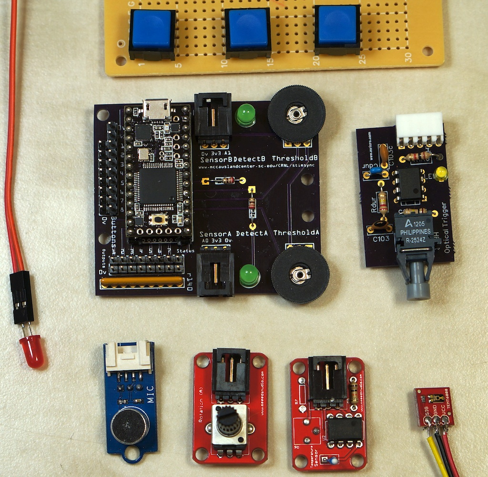
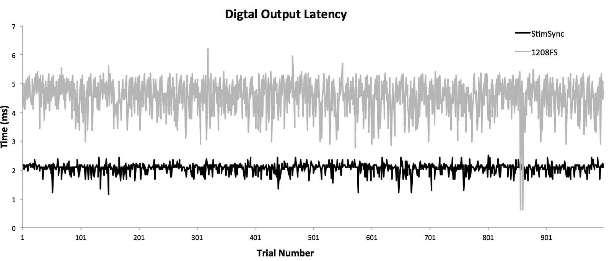
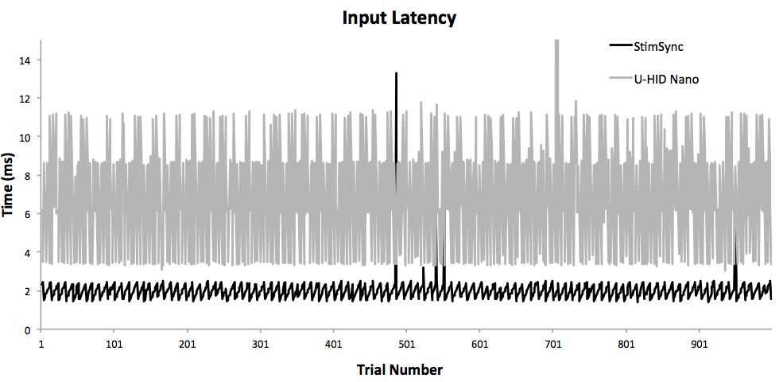
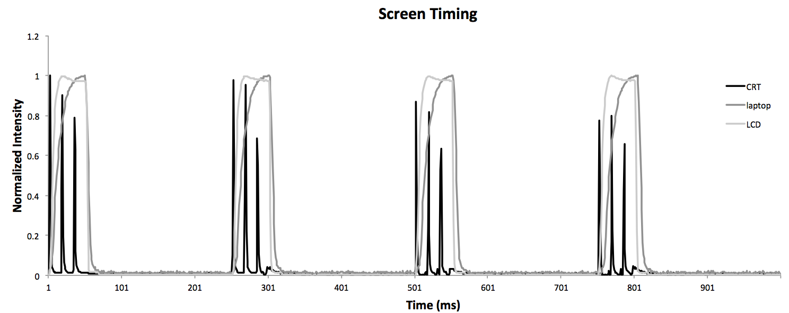
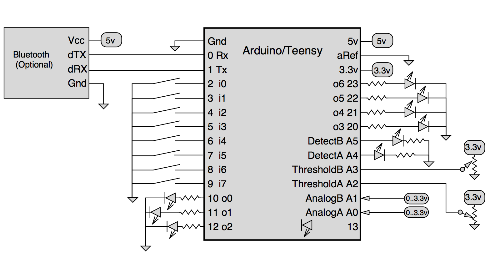
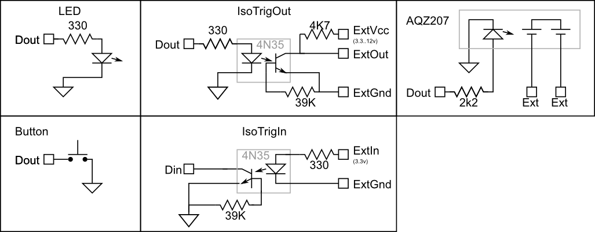
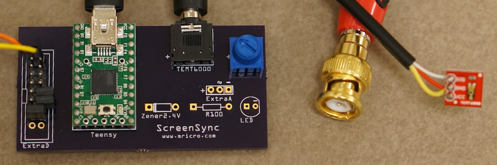
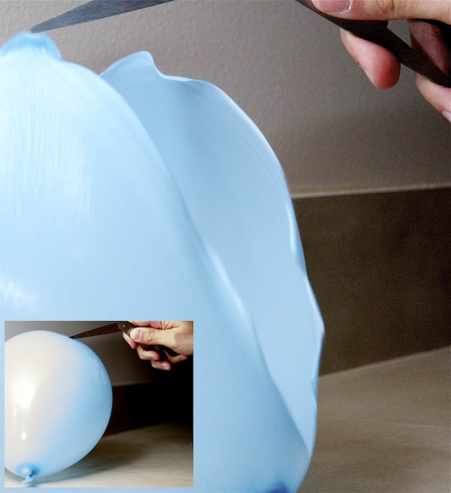

# StimSync

Rorden, C., & Hanayik, T. (2014). StimSync: Open-source hardware for behavioral and MRI experiments. Journal of neuroscience methods, 227, 90-99.

-   The source folder provides full documentation for advanced users, and details on how to validate the device with your own hardware and software. It includes examples for [EPrime](https://www.pstnet.com/eprime.cfm) , [OpenSesame](https://osdoc.cogsci.nl/) , [Presentation](https://www.neurobs.com/) , [PsychoPy](https://github.com/psychopy/psychopy/) , and [psychtoolbox](http://psychtoolbox.org).
-   The [Oscilloscope](https://github.com/neurolabusc/oscilloscope) repository describes how to display and log time traces from the StimSync.

Many neuroscience experiments rely on presenting stimuli and recording the subsequent responses. For most studies, commodity computers are sufficient for these behavioral experiments -- presenting images on a computer screen, presenting sounds with computer speakers and recording responses with a keyboard. However, these devices are not adequate for all studies -- for example we may want to present a tactile stimuli or control brain stimulation (e.g. a transcranial magnetic stimulation device). Further, keyboards are not always suitable input devices -- for example we may want to use large buttons for individuals with motor impairments or small levers for rodents. While there are many proprietary solutions for this problem they are generally expensive and hard to integrate with a study. Here we describe the open source hardware and software StimSync to solve this problem.

- Digital outputs: independently control seven output devices. These can be controlled by sending a single byte of data across the USB port (or wirelessly via Bluetooth).
- Digital inputs: provides eight inputs that can be mapped to any keyboard key. This emulates a (high-speed) USB keyboard so it is easy to use with most experimental software.
- Analog inputs: allows two devices with continuous outputs to emulate a keyboard key. A knob adjusts the sensitivity. This allows you to have a simple voice key.
- Analog recording: allows you to visualize the analog inputs and save the data for offline analysis. This can be used for measuring screen rise/fall times, but can also be used to measure [accelerometers](https://www.adafruit.com/products/1018) , temperature, [pulse](https://pulsesensor.com/) , or other inputs. - Microsecond timing: this allows you to validate the timing of events with greater precision than available with the USB port.

## Digital outputs

The StimSync can drive up to seven independent external devices. This allows you to trigger TMS, timestamp EEG/iEEG signals, and present stimuli in any modality (touch, sound, sight, smell, taste). This is done by sending a single byte of data to the StimSync using either the USB port or a Bluetooth controller. Our (Teensy 3 based) reference design drives 3.3v signals up to 9.4mA, StimSyncs made with AVR-based CPUs will drive 5v at up to 20mA. We provide sample experiments for EPrime and PsychToolbox. This simple communication requires no special libraries (e.g. DLLs) and so it is generally easy to support with other software. The timing accuracy is generally limited by the computer running the experiment and the latency of the USB/Bluetooth connection. In our testing the mean latency was around 2ms (with a standard deviation of 0.17ms), outperforming the popular professional Measurement Computing 1208fs.

## Digital inputs

The StimSync can generate keyboard signals when button presses are detected, alternately these inputs can record digital signals from other electronic devices. Each key can be mapped to emulate any keyboard key. You can set a minimum key repeat rate (for de-bouncing). The host computer sees the StimSync as a USB keyboard with the fastest possible (1ms) polling rate. The timing accuracy is generally limited by the computer running the experiment and the latency of the USB/Bluetooth connection. In our testing the mean latency was around 2ms (with a standard deviation of 0.54ms), outperforming the professional UHID Nano. This is superior to commodity [keyboards and mice](https://pubmed.ncbi.nlm.nih.gov/19587169) and sufficient for most studies.

## Analog inputs

The StimSync allows you to measure analog signals -- like sounds recorded by a microphone, illumination measured by an ambient light sensor, acceleration, etc. Our reference board uses the same connector as the [Electronic Brick](https://www.seeedstudio.com/Electronic-brick-Starter-kit-p-506.html) and [Phidget](https://www.phidgets.com/products.php?category=1), so any devices that work with those should work with the StimSync (note that ARM based designs like our reference support 3.3v signals while AVR based StimSyncs use a 5v signal). A knob allows you to adjust the sensitivity of this signal, so when a large (loud, hot, bright, etc) signal occurs a keyboard key is generated. One nice use for this is as a voice key that detects vocal responses.

## Analog recording

Any of the analog inputs can also be visualized as an oscilloscope trace. We provide Processing, Matlab, Lazarus and XCode applications that display these inputs. These can be saved as text or Brain Vision Analyzer format files for offline analysis. We describe these in more detail on a [separate page]([Oscilloscope](https://github.com/neurolabusc/oscilloscope)). The image shows one particular use for behavioral scientists -- evaluating the rise and fall time for the computer display used to present stimuli. In this example computer screens switch to white for a few frames and then back to black for a few frames. We used a [SparkFun TEMT6000 Ambient Light Sensor](https://www.sparkfun.com/products/8688) to measure this signal. The cathode ray tube monitor flashes with each frame showing classic phosphor decay. The laptop LCD display is very slow to turn on and off, while the desktop LCD display that is designed for 3D video games (where the scene needs to flicker in sync with shutter glasses) shows a more crisp profile. A few words about sensors any optical sensors are tuned for infrared light, yet many modern LCD displays produce very little LED light. You want an optical sensor that has similar sensitivity to the human eye (like the TEMT6000).

## Microsecond timing

As can be seen in the images above, the StimSync shows pretty good timing of the inputs and outputs, and in general should be sufficient for most behavioral experiments (thanks to the central limit theorem, we can detect small effects even with slightly noisy timing. However, the graphs do demonstrate that there are occasional outliers, perhaps reflecting the fact that the host computer is running a multi-tasking operating system (macOS, Windows, Linux) that is doing other tasks. If timing is really important, the StimSync has two tricks up its sleeve. First, it is a standalone computer and you can write your own Arduino sketches to control any outputs and record any inputs independent of the host computers timing. Alternatively, we have included a millisecond timing mode that allows you to measure when events happened with higher accuracy than possible with a USB keyboard (which are limited to millisecond polling rates). This can be used to measure the relative timing of events (key responses to items flashing on a screen) or to validate an experiment (is a TMS pulse really occurring 100ms after an image is presented on the screen?). While we refer to this as 'microsecond' timing, we should point out that what we really mean is 'sub-millisecond' -- since tasks like checking the analog inputs takes a finite amount of time and the reference Teensy 3 only runs at 48 mHz, while the resolution of the timing is in microseconds the precision is a little poorer -- when we compared this to an oscilloscope sending a 20Hz signal we observed a standard deviation of 0.08ms. In any case, this is typically good enough for most situations.

## Software and Hardware

This is open source software and hardware. You are free to make your own. However, we have purchased a batch of components, so we are selling a number of them at a reasonable cost. The idea is to demonstrate the market for these devices so professional vendors will make them. Regardless of whether you buy a pre-built StimSync or make your own, you can modify the software as you wish. You can download the source code and hardware design files from our oscilloscope project page. This project is built around either a [Teensy 3](https://www.pjrc.com/teensy/pinout.html) ($19, our reference design), [Teensy](https://www.pjrc.com/teensy/) ($19) or an open source [Arduino](https://arduino.cc/) (about $29: be careful to choose a device that natively supports USB UHID like the Leonardo) . You will also need a [10K Ohm potentiometer](https://www.sparkfun.com/products/9806) , some routing [wire](https://www.sparkfun.com/products/10897) , a few [jumpers](https://www.sparkfun.com/products/9044) and [header pins](https://www.sparkfun.com/products/116) . For convenience, I used a [Audio Jack 3.5mm](https://www.sparkfun.com/products/8032) and [3.5mm cable](https://www.sparkfun.com/products/8566) (must be stereo, not mono) that allows the sensor to be positioned easily. You will also need a [bread board](https://www.sparkfun.com/products/137) or have a custom printed circuit board manufactured for you (in the USA I suggest [OSH Park](https://oshpark.com/) , while Europeans should consider the [Fritzing Fab](https://fab.fritzing.org/fritzing-fab) ). If you want to have your board fabricated, you can use the Fritzing or Gerber files included in the software download.

The repository includes:

-   Arduino firmware to program the StimSync
-   Arduino firmware to re-program BlueTooth modules for high speed wireless communication
-   Fritzing/Gerber design files and schematics
-   Our keyboard mapper program for assigning which keyboard keys are associated with each input.
-   Sample experiments using EPrime, PsychToolbox, PsychoPy

In addition, for advanced users who want to create their own software for the StimSync, we provide an [API (Application Programming Interface)](./API) that describes how to control the device with software and includes examples in the cross platform Python language.

## Simple digital inputs and outputs

The image on the right shows a few basic digital circuits. The top row shows digital outputs. The simplest output is the light emitting diode (LED) that illuminates when the output is on: you select a resistor (330 ohms will provide about 5 mA for a 3.3v Arduino and 10mA for a 5v Arduino), connect the anode to the output and the cathode to ground (0v). The "IsoTrigOut" shows a how to make an electrically isolated digital output -- this is useful when you want to control a device but do not want any electrical connections between devices. The AQZ207 shows how you can operate a solid state relay for controlling larger loads (you will want to use a 2200 ohm resistor for a 3.3v Arduino, and a 3900 ohm resistor for 5v devices). The simplest digital input is momentary switch button -- simply connecting the input line to ground will generate a signal. The 'IsoTrigIn' shows how to build an optically isolated digital input, where there are no electrical connections between the external device and the Arduino. Our [DIY fMRI](https://crnl.readthedocs.io/diy_fmri/index.html) page shows how to convert optical trigger pulses from a MRI scanner into digital inputs using a HFBR2524 and a 555 timer.

## Analog inputs

Other sections describe how specific analog sensors can be used for a wide range of applications. Here is a brief list of a few possible sensors:

-   Any potentiometer can act as a sensor to measure the position of a knob as it is turned. Pulse sensors, triple-axis accelerometer and temperature sensors are all widely available.
-   [light sensor](https://www.sparkfun.com/products/8688) for observing a computer screen.
-   [Microphone](https://www.sparkfun.com/products/9964) to act as a voice key. You can also use a standard computer microphone, but you will need to build a pre-amplifier, here is a nice [pre-amplifier schematic](https://www.sparkfun.com/datasheets/BreakoutBoards/Amplified-Mic-Electret-v14.pdf).

## Application: Transcranial Magnetic Stimulation trigger

Most TMS devices allow you to set up an external trigger using a TTL pulse via a BNC connector. You can connect the BNC directly to the digital output of the StimSync. However, you may want to make this connection optically isolated (e.g. with a 4N35) -- this is critical if you are using the same StimSync as an EMG with wires connected to the participant.

## Application: Voice Key and Button Box

A voice key is a device that sends a signal when a vocal response is detected, for example a voice activated mouse click or keyboard response. This is useful for many speech and language studies. Several professional voice keys are produced, for example by [Cedrus](https://cedrus.com) and [PST](https://www.pstnet.com). For this application, you simply need to replace the optical sensor with an [amplified microphone](https://www.sparkfun.com/products/9964). I recommend purchasing the [Sparkfun amplified microphone](https://www.sparkfun.com/products/9964) and removing the small microphone and then connecting a commodity headset with a boom microphone on it. This allows you to record vocal responses.

## Application: Intracranial EEG logging

Intracranial EEG plays an important role for planning surgeries. These critical clinical procedures can offer a unique opportunity to observe the function of the human brain with incredible spatial and temporal precision -- avoiding the impedance and source issues inherent to scalp-based recordings. Hence, they provide a unique research opportunity. However, many clinical systems do not provide a direct means to record digital inputs that time-stamp when an individual experienced an event. Using this circuit, we can send an electrical signal to the EEG system that is time-locked to an auditory event (vocal response, or acoustic stimuli) or visual event (appearance of an item on a computer screen). For this application, you will want to set the pulse duration to about 5ms and the signal to about 1mV (you can do this by putting a voltage divider on the output -- e.g. a 1M resistor from the output with a 1K pull-down to ground).

## Application: Stop Motion Flash Photography

This circuit and the basic Arduino software can also be used to trigger a camera flash in respone to an optical or auditory signal. With my circuit, you can use the [ambient light sensor](https://www.sparkfun.com/products/8688) as an optical tripwire or the [amplified microphone](https://www.sparkfun.com/products/9964) as an auditory trigger. Be warned that some flash hot shoes have a very high voltage, so if you connect directly to the hot shoe make sure your circuit is optically isolated. Alternatively, if your flash has a PC sync connector, you can get PC sync cables online for a few dollars -- this connection uses the same voltage as the Arduino/Teensy digital outputs so you only need to connect the ground to the outside shield and the digital output from the Teensy/Arduino to the center pin.

The trick is to set your flash for minimum brightness (and hence minimum duration). For the photo above of the popping balloon we used a flash at 1/128 of full power (\~1/8000s illumination). The photograph was made with a Sony NEX 5N, f/8, ISO=3200, 1.6s exposure time (though only illuminated for a fraction of this with the flash). I also set the StimSync to have the slowest possible key refresh rate, so that the flash would only be triggered by the initial sound and not the subsequent echoes.

## Alternatives

If you only want to capture digital inputs, the [UHID-Nano](https://www.u-hid.com/home/uhid_nano.php) is a terrific device: it simulates a USB keyboard, mouse button, or joystick button. The [Measurement Computing FS-1208](https://www.mccdaq.com/usb-data-acquisition/USB-1208FS.aspx) is a USB device that allows digital input/output as well as some analog lines. It is supported by the [PsychToolbox DAQ](http://psychtoolbox.org/docs/Daq) , making it easy to support. Professional solutions include the [PST serial response box](https://pstnet.com/products/celeritas/) and the [Cedrus Voice](https://cedrus.com/sv1/) key.

While you may be concerned about small variations in timing, in general these do not matter much in behavioral studies, as described by [Ulrich and Gray](https://onlinelibrary.wiley.com/doi/10.1111/j.2044-8317.1989.tb01111.x/abstract).
